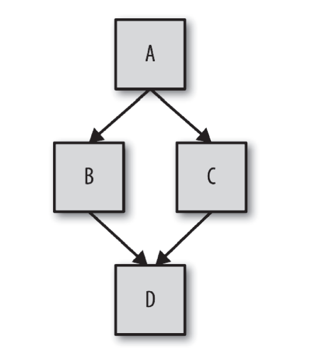

<!--
 * @Author: jiaminghui
 * @Date: 2022-12-23 21:27:24
 * @LastEditTime: 2022-12-29 16:47:32
 * @LastEditors: jiaminghui
 * @FilePath: \JavaScript_Learn\this和对象原型\混合对象类.md
 * @Description: 
-->
# 混合对象类的学习

## 类理论
1.  面向对象编程强调的是数据和操作数据的行为本质上是互相关联的，好的设计就是把数据以及和它相关的行为打包（或者说封装）起来——数据结构
2.  面向类的设计模式：实例化、继承、多态
    - 所有字符串都是String类的一个实例，也就是说它是一个包裹，包含字符数据和我们可以应用在数据上的函数
    - “汽车”可以被看作“交通工具”的一种特例，后者是更广泛的类
    - 汽车类只要声明它继承（或者扩展）了交通工具的这个基础定义就行，这就是类的继承
    - 类的另一个核心概念是多态，这个概念是说父类的通用行为可以被子类用更特殊的行为重写。父类和子类使用相同的方法名来表示特定的行为，从而让子类重写父类
    - 在JavaScript代码中这样做会降低代码的可读性和健壮性
3.  面向对象的设计模式：是在（低级）面向对象类的基础上实现了所有（高级）设计模式，似乎面向对象是优秀代码的基础
    - 迭代器模式
    - 观察者模式
    - 工厂模式
    - 单例模式
4.  JavaScript本质上没有类，由于类是一种设计模式，JavaScript提供了一些近似类的语法近似实现类的功能
5.  JavaScript的机制其实和类完全不同

## 类的机制
1.  一个类就是一张蓝图
    - 为了获得真正可以交互的对象，我们必须按照类来建造（也可以说实例化）一个东西，这个东西通常被称为实例
    - 我们可以在实例上调用方法并访问其所有公有数据属性
2.  类实例是由一个特殊的类方法构造的（**构造函数**），这个方法名通常和类名相同
    - 这个方法的任务就是初始化实例需要的所有信息（状态）
        ```javascript
        class CoolGuy { 
            specialTrick = nothing
            CoolGuy( trick ) {
                specialTrick = trick
            }
            showOff() {
                output( "Here's my trick: ", specialTrick )
            } 
        }

        //// 我们可以调用类构造函数来生成一个 CoolGuy 实例
        Joe = new CoolGuy( "jumping rope" ) 
        Joe.showOff() // 这是我的绝技：跳绳
        ```
        - CoolGuy类有一个`CoolGuy()`构造函数，执行`new CoolGuy()`时实际上调用的就是构造函数
        - 构造函数会返回一个对象（也就是类的一个实例），之后我们可以在这个对象上调用方法
    - 类构造函数属于类，而且通常和类同名
    - 构造函数大多需要用`new`来调，这样语言引擎才知道你想要构造一个新的类实例

## 类的继承
1.  在面向类的语言中，你可以先定义一个类，然后定义一个继承前者的类
2.  子类会包含父类行为的原始副本，但是也可以重写所有继承的行为甚至定义新行为
    - 父类和子类并不是实例，准确来说应该是为父类DNA和子类DNA
    - 根据DNA来创建（或者说实例化）一个人，然后才能和他进行沟通
3.  ```javascript
    class Vehicle { 
        engines = 1
        ignition() {
            output( "Turning on my engine." );
        }
        drive() {
            ignition();
            output( "Steering and moving forward!" )
        }
    }
    class Car inherits Vehicle {
        wheels = 4
        drive() {
            inherited:drive()
            output( "Rolling on all ", wheels, " wheels!" )
        } 
    }
    class SpeedBoat inherits Vehicle { 
        engines = 2
        ignition() {
            output( "Turning on my ", engines, " engines." )
        }
        pilot() {
            inherited:drive()
            output( "Speeding through the water with ease!" )
        } 
    }
    ```
    - 我们通过定义Vehicle类来假设一种发动机，一种点火方式，一种驾驶方法
    - 接下来我们定义了两类具体的交通工具：Car和SpeedBoat。它们都从Vehicle继承了通用的特性并根据自身类别修改了某些特性
    - 汽车需要四个轮子，快艇需要两个发动机，因此它必须启动两个发动机的点火装置
    - Car重写了继承自父类的`drive()`方法，但是之后Car调用了`inherited:drive()`方法，这表明Car可以引用继承来的原始`drive()`方法。这个技术被称为多态或者虚拟多态。在本例中，更恰当的说法是相对多态。在许多语言中可以使用`super`来代替本例中的`inherited:`，表示当前类的父类 / 祖先类
    - 之所以说“相对”是因为我们并不会定义想要访问的绝对继承层次，而是使用相对引用“查找上一层”
    - 多态：任何方法都可以引用继承层次中高层的方法（无论高层的方法名和当前方法名是否相同）
    - 在继承链的不同层次中一个方法名可以被多次定义，当调用方法时会自动选择合适的定义。在之前的代码中就有两个这样的例子：`drive()`被定义在 Vehicle和Car中，`ignition()`被定义在Vehicle和SpeedBoat中
    - 在JavaScript中，类是属于类的构造函数，类似`Foo.prototype...`这样的类型引用。由于JavaScript中父类和子类的关系只存在于两者构造函数对应的`.prototype`对象中，因此它们的构造函数之间并不存在直接联系，无法通过简单的`super`实现两者的相对引用（在ES6的类中可以通过super来“解决”这个问题）
    - 此外，在`pilot()`中通过相对多态引用了（继承来的）Vehicle中的`drive()`，但是那个`drive()`方法直接通过名字引用了`ignotion()`方法。实际上它会使用SpeedBoat的`ignition()`而不是Vehicle的。`ignition()`方法定义的多态性取决于你是在**哪个类的实例中引用它**
4.  在子类（而不是它们创建的实例对象！）中也可以相对引用它继承的父类，这种相对引用通常被称为super。
    - 需要注意，子类得到的仅仅是继承自父类行为的一份副本
    - 子类对继承到的一个方法进行“重写”，不会影响父类中的方法，也只有这样才能使用相对多态引用访问父类中的方法
    - 多态并不表示子类和父类有关联，子类得到的只是父类的一份副本
5.  有些面向类的语言允许你继承多个“父类”，**多重继承**意味着所有父类的定义都会被复制到子类中
    - 然而如果两个父类中都定义了`drive()`方法的话子类引用存在问题
    - JavaScript本身并不提供“多重继承”功能
    - 多重继承导致的钻石问题：
    
    
    - 在钻石问题中，子类D继承自两个父类（B和C），这两个父类都继承自A。如果A中有`drive()`方法并且B和C都重写了这个方法（多态），那当D引用`drive()`时应当选择哪个版本呢（B:drive()还是C:drive()）？
## 混入
1.  在继承或者实例化时，JavaScript的对象机制并不会自动执行复制行为，JavaScript中只有对象，并不存在可以被实例化的“类”
2.  JavaScript开发者也想出了一个方法来模拟类的复制行为，这个方法就是**混入**
3.  混入分为**显式混入**和**隐式混入**两种类型W
4.  显式混入

    JavaScript不会自动实现Vehicle到Car的复制行为，所以我们需要手动实现复制功能。这个功能在许多库和框架中被称为`extend(..)`，但是为了方便理解我们称之为`mixin(..)`
    ```javascript
    // 非常简单的 mixin(..) 例子 :
    function mixin( sourceObj, targetObj ) { 
        for (var key in sourceObj) {
            // 只会在不存在的情况下复制
            if (!(key in targetObj)) { 
                targetObj[key] = sourceObj[key];
            } 
        }
        return targetObj; 
    }
    var Vehicle = { 
        engines: 1,
        ignition: function() {
            console.log( "Turning on my engine." );
        },
        drive: function() { 
            this.ignition();
            console.log( "Steering and moving forward!" );
        }
    };
    var Car = mixin( Vehicle, {
        wheels: 4,
        drive: function() { 
            Vehicle.drive.call( this ); 
            console.log(
            "Rolling on all " + this.wheels + " wheels!" 
            );
        } 
    } );
    ```
    - 因为在JavaScript中不存在类，Vehicle和Car都是对象，供我们分别进行复制和粘贴
    - 从技术角度来说，函数实际上没有被复制，复制的是函数引用
    - Car已经有了`drive`属性（函数），所以这个属性引用并没有被`mixin`重写，从而保留了Car中定义的同名属性，实现了“子类”对“父类”属性的重写
    - `Vehicle.drive.call( this )`是**显示多态**，在之前的伪代码中对应的语句是`inherited:drive()`，我们称之为**相对多态**。JavaScript在ES6之前并没有相对多态的机制，为了指明调用对象，我们必须使用绝对引用**通过名称显式指定Vehicle对象**并调用它的`drive()`函数。注意这里还使用了`call(this)`显示绑定来确保`drive()`在Car对象的上下文中执行
    - 在JavaScript中使用显式伪多态会在所有需要使用多态引用的地方创建一个函数关联，这会极大地增加维护成本。因此应当尽量避免使用显式伪多态
    - 混入的含义：Car中混合了Vehicle的内容。复制操作完成后，Car就和Vehicle分离了，向Car中添加属性不会影响Vehicle
    - 由于两个对象引用的是同一个函数，因此这种复制（或者说混入）实际上并不能完全模拟面向类的语言中的复制。如果你修改了共享的函数对象，比如添加了一个属性，那Vehicle和Car都会受到影响
5.  寄生继承
    - 显式混入模式的一种变体被称为“寄生继承”，它既是显式的又是隐式的
    ```javascript
    // “传统的 JavaScript 类”Vehicle
    function Vehicle() { 
        this.engines = 1;
    }
    Vehicle.prototype.ignition = function() {
        console.log( "Turning on my engine." );
    };
    Vehicle.prototype.drive = function() { 
        this.ignition();
        console.log( "Steering and moving forward!" );
    };
    // “寄生类” Car
    function Car() {
        // 首先，car 是一个 Vehicle
        var car = new Vehicle();
        // 接着我们对 car 进行定制
        car.wheels = 4;
        // 保存到 Vehicle::drive() 的特殊引用
        var vehDrive = car.drive;
        // 重写 Vehicle::drive()
        car.drive = function() { 
            vehDrive.call( this ); 
            console.log(
            "Rolling on all " + this.wheels + " wheels!" 
            );
        }
        return car; 
        
    }
    var myCar = new Car();
    myCar.drive();
    // 发动引擎。
    // 手握方向盘！
    // 全速前进！
    ```
    - 首先我们复制一份Vehicle父类（对象）的定义，然后混入子类（对象）的定义（如果需要的话保留到父类的特殊引用），然后用这个复合对象构建实例
    - 上述代码可以不使用`new`关键词调用`Car`函数，因为返回了我们自己的car对象，还会避免创建并丢弃多余的对象
6.  隐式混入
    ```javascript
    var Something = { 
        cool: function() {
            this.greeting = "Hello World";
            this.count = this.count ? this.count + 1 : 1; 
        }
    };
    Something.cool(); 
    Something.greeting; // "Hello World"
    Something.count; // 1
    var Another = {
        cool: function() {
            // 隐式把 Something 混入 Another
            Something.cool.call( this ); 
        }
    };
    Another.cool();
    Another.greeting; // "Hello World"
    Another.count; // 1 （count 不是共享状态）
    ```
    - `Something.cool.call( this )`，我们实际上“借用”了函数`Something.cool()`并在Another的上下文中调用了它。最终的结果是`Something.cool()`中的赋值操作都会应用在Another对象上而不是Something对象上。因此，我们把Something的行为“混入”到了Another中