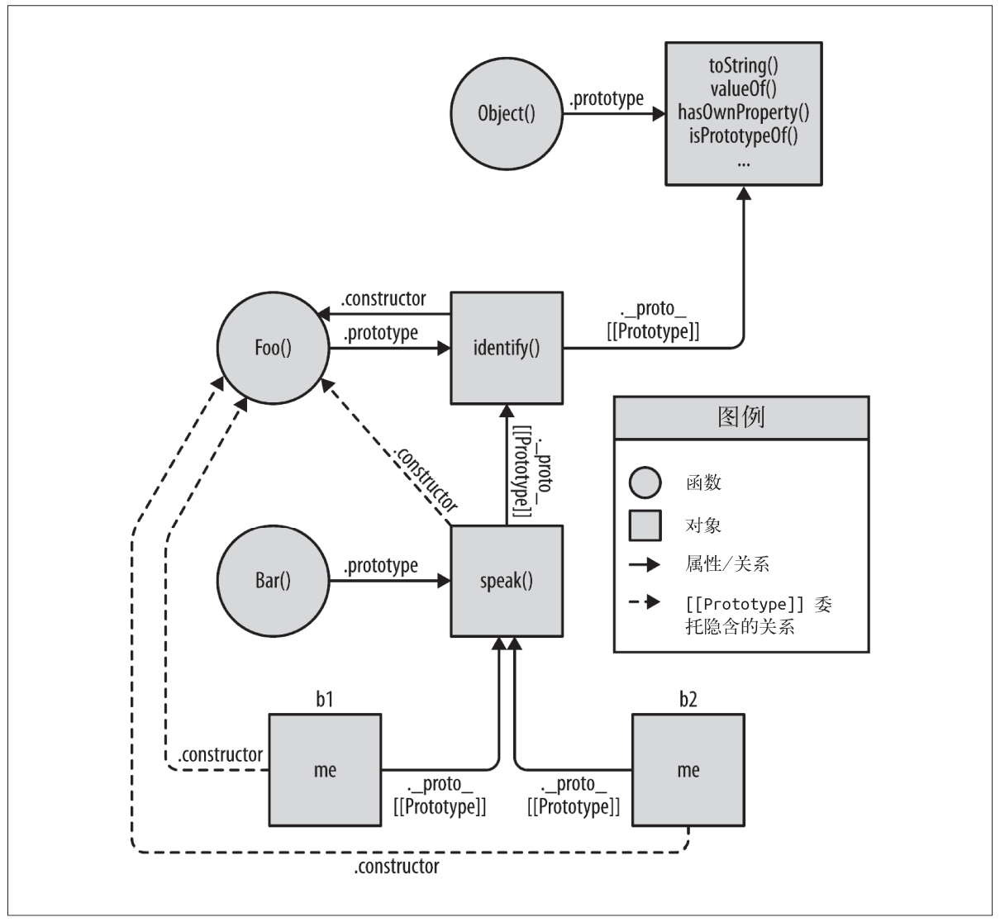
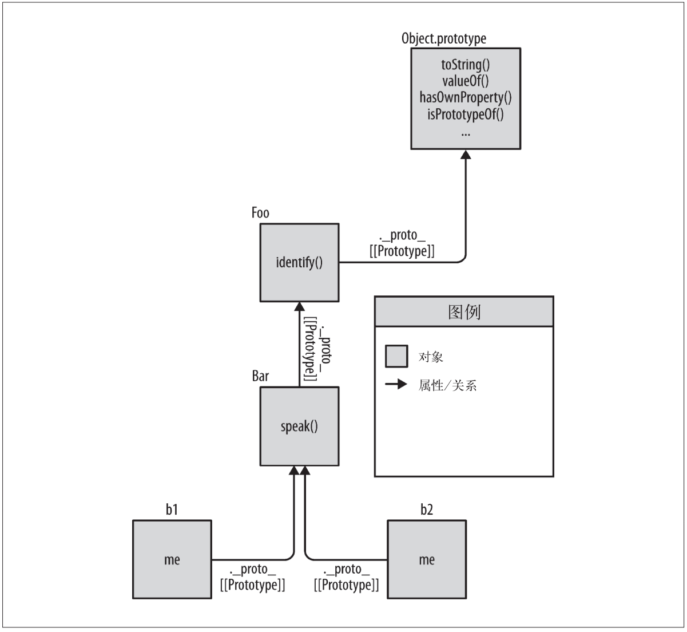

<!--
 * @Author: jiaminghui
 * @Date: 2022-12-26 15:11:12
 * @LastEditTime: 2022-12-26 22:01:58
 * @LastEditors: jiaminghui
 * @FilePath: \JavaScript_Learn\this和对象原型\行为委托.md
 * @Description: 
-->
# 行为委托的学习

## 面向委托的设计
1.  JavaScript中的`[[Prototype]]`机制本质就是**对象之间的关联关系**
2.  类理论
    ```javascript
    class Task { 
        id;
        // 构造函数 Task()
        Task(ID) { id = ID; }
        outputTask() { output( id ); }
    }
    class XYZ inherits Task { 
        label;
        // 构造函数 XYZ()
        XYZ(ID,Label) { super( ID ); label = Label; }
        outputTask() { super(); output( label ); } 
    }
    class ABC inherits Task { 
        // ...
    }
    ```
    - 上述伪代码定义一个通用父（基）类——Task，在Task类中定义所有任务都有的行为
    - 接着定义子类XYZ和ABC，它们都继承自Task并且会添加一些特殊的行为来处理对应的任务
    - 类设计模式鼓励你在继承时使用**方法重写（和多态）**，甚至在添加新行为时通过super调用这个方法的原始版本
    - 类设计好之后可以实例化子类来执行任务，因为每个实例都有你需要完成任务的所有行为。这些实例会复制Task定义的通用行为以及XYZ定义的特殊行为
3.  委托理论
    ```javascript
    Task = {
        setID: function(ID) { this.id = ID; }, 
        outputID: function() { console.log( this.id ); }
    };
    // 让 XYZ 委托 Task
    XYZ = Object.create( Task );
    XYZ.prepareTask = function(ID,Label) { 
        this.setID( ID );
        this.label = Label;
    };
    XYZ.outputTaskDetails = function() { 
        this.outputID();
        console.log( this.label ); 
    };
    // ABC = Object.create( Task );
    // ABC ... = ...
    ```
    委托行为的思考方式：
    - 首先你会定义一个名为Task的对象，它会包含所有任务都可以使用（委托）的具体行为
    - 对于每个任务（“XYZ”、“ABC”）你都会定义一个对象来存储对应的数据和行为
    - 特定的任务对象都会关联到Task功能对象上（`XYZ = Object.create( Task );`），让它们在需要的时候可以进行委托
    - 在执行“XYZ”任务时，需要两个对象（“XYZ”与“Task”）协作完成，我们只需要通过委托来让任务“XYZ”需要时委托给“Task”
- 上述编程风格称为**对象关联**，我们真正关心的只是XYZ对象（和ABC对象）委托了Task对象
- 对象关联风格的代码与类风格代码还有一点区别
    - 对象关联风格代码中的`id`和`label`数据成员都是直接存储在XYZ上（而不是Task）。`[[Prototype]]`委托中最好把状态保存在委托者（XYZ、ABC）而不是委托目标（Task）上
    - 在类设计模式中，我们故意让父类（Task）和子类（XYZ）中都有`outputTask`方法，这样就可以利用重写（多态）的优势。在委托行为中则恰好相反：**我们会尽量避免在`[[Prototype]]`链的不同级别中使用相同的命名，否则还需要想办法消除歧义**
    - `this.setID(ID)`通过`[[Prototype]]`委托机制关联到 Task上寻找方法。此外由于调用位置触发了this的隐式绑定规则，运行时this会绑定到XYZ
4.  委托行为意味着某些对象（XYZ）在找不到属性或者方法引用时会把这个请求委托给另一个对象（Task）。**对象是通过任意方向的委托关联并排组织的**
5.  注意在委托设计模式中，委托最好在内部实现，不要直接暴露出去。例如上述例子中，我们没有直接使用`XYZ.setID()`，而是把委托隐藏在了API的内部，`XYZ.prepareTask(..)`会委托`Task.setID(..)`
6.  委托设计时的注意事项
    - 禁止互相委托。无法在两个或两个以上互相（双向）委托的对象之间创建循环委托。如果你引用了一个两边都不存在的属性或者方法，那就会在`[[Prototype]]`链上产生一个无限递归的循环。此外禁止互相委托更加高效
    - chrome在调试时，会跟踪对象的构造函数名称，而使用对象关联风格写代码时并不需要关心是谁构造了对象
        ```javascript
        //// chrome跟踪构造函数名称
        function Foo() {}
        var a1 = new Foo();
        a1; // Foo {}

        function Foo() {} 
        var a1 = new Foo();
        a1.constructor; // Foo(){} 
        a1.constructor.name; // "Foo"

        //// chrome无法跟踪采用对象关联风格创建对象的构造函数名称
        var Foo = {};
        var a1 = Object.create( Foo ); 
        a1; // Object {}
        ```
        - Chrome实际上想说的是“{} 是一个空对象，由名为Foo的函数构造”。Chrome会动态跟踪并把实际执行构造过程的函数名当作一个内置属性
        - 采用对象关联风格来编写代码，那Chrome就无法跟踪对象内部的“构造函数名称”，这样的对象输出是`Object {}`，意思是“Object() 构造出的对象”
        - 当你使用对象关联风格来编写代码并使用行为委托设计模式时，并不需要关注是谁“构造了”对象。只有使用类风格来编写代码时 Chrome 内部的“构造函数名称”跟踪才有意义
7.  委托和类设计模型思想上的区别
    - 类设计模型代码
        ```javascript
        function Foo(who) { 
            this.me = who;
        }
        Foo.prototype.identify = function() {
            return "I am " + this.me; 
        };
        function Bar(who) { 
            Foo.call( this, who );
        }
        Bar.prototype = Object.create( Foo.prototype );
        Bar.prototype.speak = function() {
            alert( "Hello, " + this.identify() + "." );
        };
        var b1 = new Bar( "b1" );
        var b2 = new Bar( "b2" ); 
        b1.speak();
        b2.speak();
        ```
        - 子类Bar继承了父类Foo，然后生成了b1和b2两个实例
        - b1委托了Bar.prototype，后者委托了Foo.prototype
    - 对象关联风格代码
        ```javascript
        Foo = {
            init: function(who) {
                this.me = who; 
            },
            identify: function() { 
                return "I am " + this.me;
            }
        };
        Bar = Object.create( Foo );
        Bar.speak = function() {
            alert( "Hello, " + this.identify() + "." );
        };
        var b1 = Object.create( Bar ); 
        b1.init( "b1" );
        var b2 = Object.create( Bar ); 
        b2.init( "b2" );
        b1.speak();
        b2.speak();
        ```
        - 这段代码中我们同样利用`[[Prototype]]`把b1委托给 Bar并把Bar委托给Foo，实现了三个对象之间的关联
    - 类设计模型与对象关联设计模型的模型图
        - 类设计模型
        
        - 对象关联设计模型
        
8.  创建UI控件案例
    - 原型类设计模式下的应用
        ```javascript
        // 父类
        function Widget(width,height) { 
            this.width = width || 50; 
            this.height = height || 50; 
            this.$elem = null;
        }
        Widget.prototype.render = function($where){ 
            if (this.$elem) {
                this.$elem.css( {
                width: this.width + "px", 
                height: this.height + "px"
                } ).appendTo( $where );
            }
        };
        // 子类
        function Button(width,height,label) { 
            // 调用“super”构造函数
            Widget.call( this, width, height ); 
            this.label = label || "Default";
            this.$elem = $( "<button>" ).text( this.label ); 
        }
        // 让 Button“继承”Widget
        Button.prototype = Object.create( Widget.prototype );
        // 重写 render(..)
        Button.prototype.render = function($where) { 
            // “super”调用
            Widget.prototype.render.call( this, $where );
            this.$elem.click( this.onClick.bind( this ) ); 
        };
        Button.prototype.onClick = function(evt) {
            console.log( "Button '" + this.label + "' clicked!" );
        };
        $( document ).ready( function(){
            var $body = $( document.body );
            var btn1 = new Button( 125, 30, "Hello" ); 
            var btn2 = new Button( 150, 40, "World" );
            btn1.render( $body );
            btn2.render( $body ); 
        } );
        ```
        - 上述代码在父类Widget中定义基础的`render(..)`，然后在子类中重写它
        - 子类并不会替换基础的`render(..)`，只是添加一些按钮特有的行为
        - 上述代码中出现了丑陋的显式伪多态`Widget.call`和`Widget.prototype.render.call`从“子类”方法中引用“父类”中的基础方法
    - ES6的class语法糖
        ```javascript
        class Widget { 
            constructor(width,height) {
                this.width = width || 50; 
                this.height = height || 50; 
                this.$elem = null;
            }
            render($where){
                if (this.$elem) { 
                    this.$elem.css( {
                    width: this.width + "px",
                    height: this.height + "px" 
                    } ).appendTo( $where );
                } 
            }
        }
        class Button extends Widget { 
            constructor(width,height,label) {
                super( width, height );
                this.label = label || "Default";
                this.$elem = $( "<button>" ).text( this.label );
            }
            render($where) {
                super( $where );
                this.$elem.click( this.onClick.bind( this ) ); 
            }
            onClick(evt) {
                console.log( "Button '" + this.label + "' clicked!" );
            } 
        }
        $( document ).ready( function(){
            var $body = $( document.body );
            var btn1 = new Button( 125, 30, "Hello" ); 
            var btn2 = new Button( 150, 40, "World" );
            btn1.render( $body );
            btn2.render( $body ); 
        } );
        ```
        - 使用ES6的class语法糖之后，之前丑陋的**显示伪多态**不见了，取而代之的是使用`super(..)`
    - 无论你使用的是**传统的原型语法**还是**ES6中的新语法糖**，你仍然需要用“类”的概念来对问题（UI控件）进行建模
    - 委托控件对象，对象关联设计模式下的应用
        ```javascript
        var Widget = {
            init: function(width,height){
                this.width = width || 50; 
                this.height = height || 50; 
                this.$elem = null;
            },
            insert: function($where){
                if (this.$elem) { 
                    this.$elem.css( {
                    width: this.width + "px",
                    height: this.height + "px" 
                    } ).appendTo( $where );
                } 
            }
        };
        var Button = Object.create( Widget );
        Button.setup = function(width,height,label){ 
            // 委托调用
            this.init( width, height );
            this.label = label || "Default";
            this.$elem = $( "<button>" ).text( this.label ); 
        };
        Button.build = function($where) {
            // 委托调用
            this.insert( $where );
            this.$elem.click( this.onClick.bind( this ) );
        };
        Button.onClick = function(evt) {
            console.log( "Button '" + this.label + "' clicked!" ); 
        };
        $( document ).ready( function(){ 
            var $body = $( document.body );
            var btn1 = Object.create( Button ); 
            btn1.setup( 125, 30, "Hello" );
            var btn2 = Object.create( Button ); 
            btn2.setup( 150, 40, "World" );
            btn1.build( $body );
            btn2.build( $body ); 
        } );
        ```
        - 使用对象关联风格来编写代码时不需要把Widget和Button当作父类和子类
        - Widget只是一个对象，包含一组通用的函数，任何类型的控件都可以委托，Button同样只是一个对象，它会通过委托关联到Widget
        - 对象关联的设计模式，们并没有像类一样在两个对象中都定义相同的方法名`render(..)`而是定义了两个更具描述性的方法名（`insert(..)`和 `build(..)`）和初始化方法（`init(..)`和`setup(..)`）
        - 此外对象关联避免了丑陋的显示伪多态，而是用简单的相对委托调用`this.init(..)`和`this.insert(..)`
        - 对象关联将实例化分解为了**构造和初始化**两个步骤，这可以更灵活地让两个步骤出现在不同的位置，而不必在同一个步骤中（`new`构造函数调用）实现构造和初始化
9.  行为委托模式可以简化代码结构
    - 应用场景：我们有两个控制器对象，一个用来操作网页中的登录表单，另一个用来与服务器进行验证（通信）
        - 类设计模式
            ```javascript
            // 父类
            function Controller() {
                this.errors = [];
            }
            Controller.prototype.showDialog(title,msg) {
                // 给用户显示标题和消息
            };
            Controller.prototype.success = function(msg) {
                this.showDialog( "Success", msg ); 
            };
            Controller.prototype.failure = function(err) { 
                this.errors.push( err );
                this.showDialog( "Error", err );
            };
            // 子类
            function LoginController() { 
                Controller.call( this );
            }
            // 把子类关联到父类
            LoginController.prototype = Object.create( Controller.prototype );
            LoginController.prototype.getUser = function() {
                return document.getElementById( "login_username" ).value;
            };
            LoginController.prototype.getPassword = function() {
                return document.getElementById( "login_password" ).value; 
            };
            LoginController.prototype.validateEntry = function(user,pw) { 
                user = user || this.getUser();
                pw = pw || this.getPassword();
                if (!(user && pw)) { 
                    return this.failure(
                    "Please enter a username & password!"
                    ); 
                }
                else if (user.length < 5) { 
                    return this.failure(
                    "Password must be 5+ characters!"
                    ); 
                }
                // 如果执行到这里说明通过验证
                return true; 
            };
            // 重写基础的 failure()
            LoginController.prototype.failure = function(err) { 
                // “super”调用
                Controller.prototype.failure.call( 
                this,
                "Login invalid: " + err
                );
            };
            // 子类
            function AuthController(login) {
                Controller.call( this );
                // 合成
                this.login = login;
            }
            // 把子类关联到父类
            AuthController.prototype = Object.create( Controller.prototype );
            AuthController.prototype.server = function(url,data) { 
                return $.ajax( {
                    url: url,
                    data: data 
                } );
            };
            AuthController.prototype.checkAuth = function() {
                var user = this.login.getUser(); 
                var pw = this.login.getPassword();
                if (this.login.validateEntry( user, pw )) { 
                    this.server( "/check-auth",{
                        user: user,
                        pw: pw 
                    } )
                    .then( this.success.bind( this ) )
                    .fail( this.failure.bind( this ) ); 
                }
            };
            // 重写基础的 success()
            AuthController.prototype.success = function() { 
                // “super”调用
                Controller.prototype.success.call( this, "Authenticated!" ); 
            };
            // 重写基础的 failure()
            AuthController.prototype.failure = function(err) { 
                // “super”调用
                Controller.prototype.failure.call( 
                this,
                "Auth Failed: " + err
                );
            };
            // 除了继承，我们还需要合成
            var auth = new AuthController(new LoginController()); 
            auth.checkAuth();
            ```
            - 所有控制器共享的基础行为是`success(..)`、`failure(..)`和`showDialog(..)`
            - 子类LoginController和AuthController通过重写`failure(..)`和`success(..)`来扩展默认基础类行为
            - AuthController需要一个LoginController的实例来和登录表单进行交互，因此这个实例变成了一个数据属性
            - AuthController需要使用LoginController，因此我们实例化后者（`new LoginController()`）并用一个类成员属性`this.login`来引用它，这样AuthController就可以调用LoginController的行为。这里使用**合成而非继承**，是因为两者之间都不具备对方的基础行为所以这种继承关系是不恰当的
        - 对象关联设计模型
            ```javascript
            var LoginController = { 
                errors: [],
                getUser: function() {
                    return document.getElementById(
                    "login_username"
                    ).value; 
                },
                getPassword: function() {
                    return document.getElementById(
                    "login_password"
                    ).value; 
                },
                validateEntry: function(user,pw) { 
                    user = user || this.getUser(); 
                    pw = pw || this.getPassword();
                    if (!(user && pw)) { 
                        return this.failure(
                        "Please enter a username & password!"
                        ); 
                    }
                    else if (user.length < 5) { 
                        return this.failure(
                        "Password must be 5+ characters!"
                        ); 
                    }
                    // 如果执行到这里说明通过验证
                    return true; 
                },
                showDialog: function(title,msg) {
                    // 给用户显示标题和消息
                },
                failure: function(err) {
                    this.errors.push( err );
                    this.showDialog( "Error", "Login invalid: " + err ); 
                }
            };
            // 让 AuthController 委托 LoginController
            var AuthController = Object.create( LoginController );
            AuthController.errors = []; 
            AuthController.checkAuth = function() {
                var user = this.getUser(); 
                var pw = this.getPassword();
                if (this.validateEntry( user, pw )) { 
                    this.server( "/check-auth",{
                        user: user,
                        pw: pw 
                    } )
                    .then( this.accepted.bind( this ) )
                    .fail( this.rejected.bind( this ) ); 
                }
            };
            AuthController.server = function(url,data) {
                return $.ajax( { 
                    url: url,
                    data: data 
                } );
            };
            AuthController.accepted = function() {
                this.showDialog( "Success", "Authenticated!" ) 
            };
            AuthController.rejected = function(err) { 
                this.failure( "Auth Failed: " + err );
            };
            ```
            - 由于AuthController只是一个对象（LoginController也一样），因此我们不需要实例化（比如`new AuthController()`），只需要一行代码就行`AuthController.checkAuth();`
            - 在行为委托模式中，AuthController和LoginController只是对象，它们之间是兄弟关系，并不是父类和子类的关系
            - 对象关联并不需要实例化对象，可以简单地向委托链上添加一个或多个对象
                ```javascript
                var controller1 = Object.create( AuthController ); 
                var controller2 = Object.create( AuthController );
                ```
            - 相较于类设计模式，对象关联设计模式只需要两个对象实体（LoginController和AuthController），而类设计模式需要三个
            - 此外对象关联并不需要**合成**，通过委托即可进行合作
10. ES6的class语法可以简洁地定义类方法
    ```javascript
    class Foo {
        methodName() { /* .. */ }
    }
    ```
    - 在ES6中我们可以在任意对象的字面形式中使用简洁方法声明
        ```javascript
        var LoginController = { 
            errors: [],
            getUser() { // 妈妈再也不用担心代码里有 function 了！
                // ...
            },
            getPassword() {
                // ...
            }
            // ...
        };
        ```
        - 对象的字面形式仍然需要使用“,”来分隔元素，而class语法不需要
    - 在ES6中，你可以使用对象的字面形式来改写之前繁琐的属性赋值语法（比如AuthController定义`var AuthController = Object.create( LoginController );`），使用`Object.setPrototypeOf(..)`来修改它的`[[Prototype]]`
        ```javascript
        // 使用更好的对象字面形式语法和简洁方法
        var AuthController = { 
            errors: [],
            checkAuth() { 
                // ...
            },
            server(url,data) {
                // ...
            }
            // ...
        };
        // 现在把 AuthController 关联到 LoginController
        Object.setPrototypeOf( AuthController, LoginController );
        ```
    - ES6的简洁方法会导致匿名函数表达式赋值给属性，出现匿名函数表达式存在的问题
        ```javascript
        var Foo = {
            bar() { /*..*/ },
            baz: function baz() { /*..*/ }
        };

        ////去掉语法糖之后的代码如下所示
        var Foo = {
            bar: function() { /*..*/ }, 
            baz: function baz() { /*..*/ }
        };
        ```
        - 匿名函数表达式的缺点：
            1. 调试栈更难追踪
            2. 自我引用（递归、事件（解除）绑定，等等）更难
            3. 代码（稍微）更难理解
        - 简洁方法会给对应的函数对象设置一个内部的name属性，理论上可以用在追踪栈中，所以简洁方法可以避免匿名函数表达式的第一个缺点
        - 简洁方法无法避免匿名函数表达式第二个缺点
            ```javascript
            var Foo = {
                bar: function(x) {
                    if(x<10){
                        return Foo.bar( x * 2 );
                    }
                    return x; 
                },
                baz: function baz(x) { 
                    if(x < 10){
                        return baz( x * 2 ); 
                    }
                    return x; 
                }
            };
            ```
            - 在本例中使用`Foo.bar(x*2)`可以完成自我引用，但是在多个对象通过代理共享函数、使用this绑定等情况下无法使用这种方法
            - 因此这种情况下最好的办法就是使用函数对象的name标识符来进行真正的自我引用（需要自我引用的话，那最好使用传统的具名函数表达式来定义对应的函数）
11. 内省：就是检查实例的类型。类实例的内省主要目的是通过创建方式来判断对象的结构和功能
    ```javascript
    function Foo() { 
        // ...
    }
    Foo.prototype.something = function(){
        // ...
    }
    var a1 = new Foo(); 
    // 之后
    if (a1 instanceof Foo) { 
        a1.something();
    }
    ```
    - 上述代码通过内省`instanceof`告诉我们a1是Foo“类”的一个实例。因为`Foo.prototype`（不是Foo！）在a1的`[[Prototype]]`链上
    - 当然，Foo类并不存在，只有一个普通的函数Foo，它引用了a1委托的对象（Foo.prototype）
    - 从语法角度来说，`instanceof`似乎是检查a1和Foo的关系，但是实际上它想说的是a1和Foo.prototype（引用的对象）是互相关联的
    - 使用`instanceof`来检查对象a1和某个对象的关系，那必须使用另一个引用该对象的函数才行——不能直接判断两个对象是否关联。因为`instanceof`的左侧是一个对象，右侧是一个函数
    - 下述代码构建了`Foo/Bar/b1`关系
        ```javascript
        function Foo() { /* .. */ } 
        Foo.prototype...
        function Bar() { /* .. */ }
        Bar.prototype = Object.create( Foo.prototype );
        var b1 = new Bar( "b1" );
        ```
        - 如果要使用`instanceof`和`.prototype`语义来检查本例中实体的关系，那必须这样做
            ```javascript
            // 让 Foo 和 Bar 互相关联
            Bar.prototype instanceof Foo; // true 
            Object.getPrototypeOf( Bar.prototype ) === Foo.prototype; // true 
            Foo.prototype.isPrototypeOf( Bar.prototype ); // true
            // 让 b1 关联到 Foo 和 Bar
            b1 instanceof Foo; // true
            b1 instanceof Bar; // true
            Object.getPrototypeOf( b1 ) === Bar.prototype; // true 
            Foo.prototype.isPrototypeOf( b1 ); // true 
            Bar.prototype.isPrototypeOf( b1 ); // true
            ```
            - 这是因为在JavaScript中，你必须使用`Bar.prototype instanceof Foo`来检查Bar与Foo之间的关系
            - 为了降低这种内省的复杂理解，还有一种常见但是可能更加脆弱的内省模式————“鸭子类型”
                ```javascript
                if (a1.something) { 
                    a1.something();
                }
                ```
                - “鸭子类型”说明如果看起来像鸭子，叫起来像鸭子，那就一定是鸭子
                - 上述代码假设了如果a1通过了测试`a1.something`的话，那a1就一定能调用`.something()`（无论这个方法存在于a1自身还是委托到其他对象）
                - ES6的Promise就是典型的“鸭子类型”，“鸭子类型”会存在一定风险。我们需要判断一个对象引用是否是Promise，但是判断的方法是检查对象是否有`then()`方法，如果有会期望它具有Promise的所有标准行为
                - 如果有一个不是Promise但是具有`then()`方法的对象，把它用在ES6的Promise机制中会出错
    - 使用对象关联时，所有的对象都是通过`[[Prototype]]`委托互相关联，所以内省非常简单
        ```javascript
        var Foo = { /* .. */ };
        var Bar = Object.create( Foo );
        Bar...
        var b1 = Object.create( Bar );
        
        // 让 Foo 和 Bar 互相关联
        Foo.isPrototypeOf( Bar ); // true
        Object.getPrototypeOf( Bar ) === Foo; // true
        // 让 b1 关联到 Foo 和 Bar
        Foo.isPrototypeOf( b1 ); // true 
        Bar.isPrototypeOf( b1 ); // true 
        Object.getPrototypeOf( b1 ) === Bar; // true
        ```